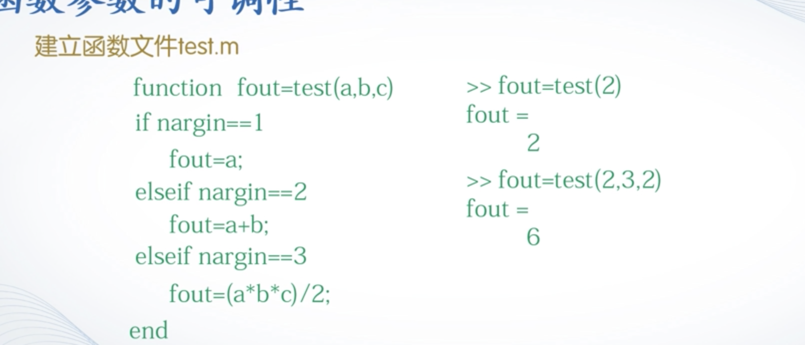

# 3.1 顺序结构程序
## 顺序结构
### 数据的输入
`A=input(提示信息，选项)`
### 数据的输出
`disp(输出项)`
### 程序的暂停
`pause(延迟秒数)`

> 例
```
a= input('a=');
b=input('b=');
c=a+0.618*(b-a)
s=abs(a-b)
disp(s)
disp(c)
```
 
# 3.2 用if语句实现选择结构

## 单分支if语句
```
if 条件
   语句组
end
```
- 条件： 当条件为矩阵时，若矩阵非空且不包含零元素，则条件成立，否则不成立。

## 双分支if语句
```
if 条件
   语句组1
else 
   语句组2
end
```
还有多分支…

# 3.3 switch语句
```
switch 表达式
   case 结果表1
      语句组1
   case 结果表2
      语句组2
   ...
   otherwise
      语句组n
end
```
- 只会执行一个语句。 


# 3.4  用for语句实现循环结构
```
for 循环变量= 初值:步长:终值
   循环体语句
end
```

# 3.5 while语句
```
while 条件
   循环体语句
end
```

# 3.6 函数的定义与调用
```
function 输出形参表=函数名（输入形参表）
注释说明部分
函数体语句
```
## 匿名函数 
类似于正则表达式

# 3.8
## 函数参数的可调性
```
nargin 输入实参的个数
nargout 输出实参的个数
```
