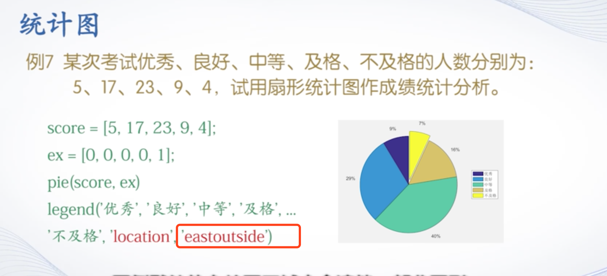

# 二维曲线

## plot函数
方法：`plot(x,y)`

`plot(x)`是以向量元素的下标为横坐标，向量元素的值为纵坐标绘图。参数x是复数向量时，则分别以该向量元素实部和虚部为横、纵坐标绘制出一条曲线。


#### `plot(x,y)`函数参数的变化形式
- x是向量，y是矩阵时，x的长度与矩阵y的行数/列数必须相等。相等的（行/列）向量绘制曲线。曲线条数等于（列/行）数。
> 例2  绘制sin(x)、sin(2x)、sin(x/2)的函数曲线。
```
x = linspace(0,2*pi,100);
y = [sin(x);sin(2*x);sin(0.5*x)];
plot(x,y)
```


- x,y是同型矩阵时，以x、y对应列元素为横、纵坐标分别绘制曲线，曲线条数等于矩阵的列数。

- 绘制不同长度绘制多条曲线，用向量对
  `plot(x1,y1,x2,y2,x3,y3,...)`

#### plot函数的选项

##### 线型：
```
- 实线
: 虚线
-. 点画线
-- 双画线
```

##### 颜色：
```
r g b w k...
红绿蓝白黑
```

##### 数据点标记：
```
默认无数据点标记符号
* 星号
o 圆圈
s 方块
p 五角星
^ 朝上三角符号
```
> 例4  用不同线型和颜色在同一坐标内绘制曲线及其包络线。
```
x = (0:pi/50:2*pi)';
y1 = 2*exp(-0.5*x).*[-1,1];
y2 = 2*exp(-0.5*x).*sin(2*pi*x);
x1 = 0:0.5:6;
y3 = 2*exp(-0.5*x1).*sin(2*pi*x1);
plot(x,y1,'k:',x,y2,'b--',x1,y3,'rp')
```


## fplot函数
可以根据参数函数的变化特性自适应地设置采样间隔。
```fplot(f,lims,选项)```
- f是一个函数，采用函数句柄
- lims为x轴取值范围[xmin,xmax]，默认[-5,5]
- 选项与plot相同

> 例6  采用fplot函数绘制函数sin⁡(1/x)。


#### 双输入函数参数的用法
`fplot(funx,funy,tlims,选项)`
> 例7  已知螺旋线的参数方程，绘制曲线。
`fplot(@(t)t.*sin(t), @(t)t.*cos(t), [0,10*pi], 'r')`


# 4.2 绘制图形的辅助操作
## 图形标注
- title(图形标题)
- xlabel（x轴说明）
- ylabel (y轴说明)
- text (x,y,图形说明)
- legend(图例1，图例2，...)

### title函数
- 支持LaTeX
- title(图形标题，属性名，属性值)

#### 属性值
- Color属性：用于设置图形标题文本的颜色
`title('y=cos{\omega}t','Color','r')`
- FontSize:设置标题文字的字号

### text函数
`text(x,y,说明)`
x，y用于说明文本的位置

`gtext(说明)` 跟随光标

## 坐标控制
### `axis(xmin,xmax,ymin,ymax,...)`函数

- axis equal: 纵横坐标轴采用等长刻度
- axis square : 产生正方形坐标系（默认为矩形）
- axis auto : 使用默认设置
- axis off: 取消坐标轴
- axis on : 显示坐标轴

### 给坐标系加网格
- grid on  
- grid off
- grid 切换 on 和 off

### 给坐标系加边框
- box on
- box off
- box

## 图形保持
- hold on
- hold off
- hold

## 图形窗口的分割
`subplot(m,n,p)`
将图形窗口分为m*n个绘图去，p指定当前活动区

- 也可以灵活地再分割


# 4.3 其他形式的二维图形绘制
## 对数坐标图
- `semilogx(x1,y1,选项,x2,y2,...)` x为对数，y为线性
- `semilogy(x1,y1,选项,x2,y2,...)` y为对数，x为线性
- `loglog(x1,y1,选项,...)`全对数

>例1 绘制1/x的直角线性坐标图和三种对数坐标图。
```
x= 0:0.1:10;
y=1./x;

subplot(2,2,1);
plot(x,y)
title('plot(x,y)')

subplot(2,2,2);
semilogx(x,y);
title('semilogx')

subplot(2,2,3);
semilogy(x,y);
title('semilogy')

subplot(2,2,4);
loglog(x,y);
title('loglog')
```


## 极坐标图
`polar(θ,ρ,选项)`
> 例2  按极坐标方程ρ=1-sin t绘制心形曲线。
```
clc,clear

t = 0:pi/100:2*pi;
r = 1-sin(t);

subplot(1,2,1)
polar(t,r)

subplot(1,2,2)
t1= t-pi/2 % 极角加角度可以使图形旋转，负数逆时针
r1= 1-sin(t1);
polar(t,r1)
```

## 统计图
### 条形图
- `bar(y,style)`垂直条形图
y为向量则以每个元素的值作为每一个矩形条的高度，对应元素下标作为横坐标 
 #### style选项
 grouped:簇状分组
 
 stacked：堆积分组

> 例3  绘制分组条形图。
```
clc,clear

y=[1,2,3,4,5; 1,2,1,2,1; 5,4,3,2,1];
subplot(1,2,1)
bar(y)
title('Group')
subplot(1,2,2)
bar(y, 'stacked')
title('Stack')
```


- `bar(x,y,style)`x向量是横坐标的数字

- `barh()`水平条形图

### 直方图
- `hist(y,x)` 直角坐标系下的直方图

  y 是要统计的数据，x用于指定区间的划分方式

> 例5  绘制服从高斯分布的直方图
```
y=randn(500,1);
subplot(2,1,1); 
hist(y); 
title('高斯分布直方图');
subplot(2,1,2); 
x=-3:0.2:3;
hist(y,x); 
title('指定区间中心点的直方图')')
```
- rose 极坐标系下的直方图
`rose(θ,x)`

###  扇形图`pie(x,explode)`
x存储待统计数据，explode控制图块的显示模式

- eastoutside

### 面积图`area()`
与plot用法相同，只是将曲线下方填充颜色


### 散点类图
- `scatter(x,y,选项，‘filled’)` 散点图
  
  filled表示可以填充数据点标记
- stairs()  阶梯图 
- stem()    杆图

### 矢量图
- compass 罗盘图
- feather 羽毛图
- quiver 箭头图

# 4.4 三维曲线
`plot3(x,y,z)`
`fplot3()`
> 例1 绘制一条空间折线。
```
x= [0.2 1.8 2.5]
y= [1.3 2.8 1.1]
z= [0.4 1.2 1.6]

plot3(x,y,z)
grid on 
axis([0 3 1 3 0 2])
```

> 例2  绘制螺旋线  
```
t= linspace(0,10*pi,200);
x= sin(t)+t.*cos(t);
y= cos(t)-t.*sin(t);
z= t;

subplot(1,2,1)
plot3(x,y,z)
grid on;

subplot(1,2,2)
plot3(x(1:4:200),y(1:4:200),z(1:4:200))
grid on;
```


# 4.5 三维曲面
首先要生成平面网格数据坐标。
## 平面网格数据的生成
1. 利用矩阵运算生成
```
clc,clear

x= 2:6;
y= (3:8)';
X= ones(size(y))*x;
Y= y*ones(size(x));
```

2. 利用meshgrid函数生成
   `[X,Y]= meshgrid(x,y);`
   当x和y相同时可以省略y


## 绘制三维曲面的函数
- mesh(x,y,z,c)  三维网格图
- surf(x,y,z,c)  三维曲面图
  * x,y,z一般是同型矩阵
  * x,y是网格坐标矩阵
  * z是网格点上的高度矩阵
  * c用于指定在不同高度下的曲面颜色。

当x,y省略时，z矩阵的第二维下标当做x轴坐标，z矩阵的第一维下标当做y轴坐标。
> 例
```
t= -2:0.2:2;
[X,Y]= meshgrid(t);
Z= X.*exp(-X.^2-Y.^2);

subplot(1,3,1);
mesh(X,Y,Z);

subplot(1,3,2);
surf(X,Y,Z);

subplot(1,3,3)'
plot3(X,Y,Z);

grid on;
```


## 其他mesh\surf函数
- meshc 带等高线的三维网格曲面函数
- meshz 带底座的三维网格曲面函数
- surfc 带等高线
- surfl 有光照效果

## 标准三维曲面
- sphere函数`[x,y,z]=sphere(n)`
 绘制球体，n决定球面光滑程度
- cylinder函数`[x,y,z]=cylinder(R,n)`

> 例4  用cylinder函数分别绘制柱面、花瓶和圆锥面。
```
clc,clear

subplot(1,3,1);
[x,y,z]= cylinder;
surf(x,y,z);

subplot(1,3,2);
t= linspace(0,2*pi,40);
[x,y,z]= cylinder(2+cos(t),30);
surf(x,y,z);

subplot(1,3,3);
[x,y,z]= cylinder(0:0.2:2,30);
surf(x,y,z);
```

## peaks

# 4.6 图形修饰处理 
## 视点处理
由方位角和仰角构成
- `view(方位角,仰角)` 以度为单位
- `view(x,y,z)`笛卡尔坐标系中的角度
- `view(2)`二维视角
- `view(3)`三维视角

## 色彩处理
 - 颜色的向量表示[R G B],范围[0,1]
 - colormap(cmap)指定色图
 - shading 控制三维图形网格内着色

## 使用NaN进行裁剪处理


# 4.7 交互式绘图工具
