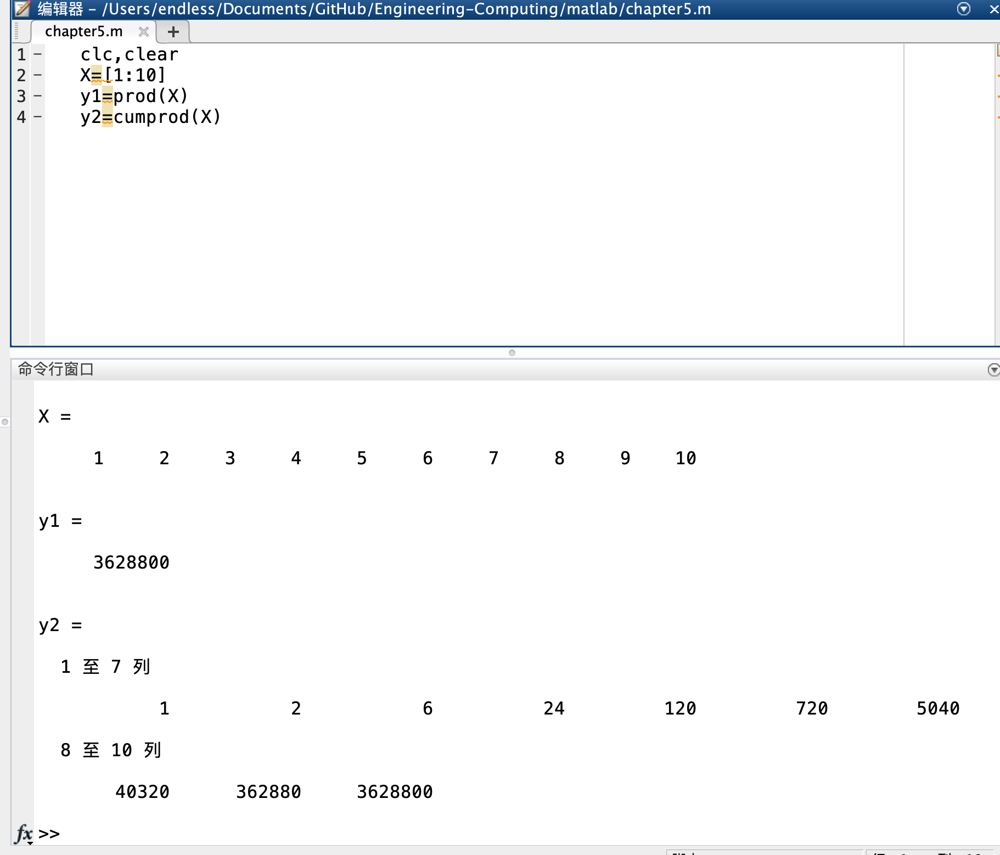

# 数据统计分析
## 求最大元素与最小元素
`max()`：求向量/矩阵的最大元素

`min()`：求向量/矩阵的最小元素

> 例1 求向量x的最大元素，其中x=[-43,72,9,16,23,47]。
```
x=[-43,72,9,16,23,47];
y=max(x)
[y,k]=max(x)
```

## 求矩阵的平均值和中值
`mean()`:求算数平均值

`median()`:求中值


> 例3 某学生宿舍的5位同学月生活费如向量x所示，其中，小明同学家境一般，请问他应该按什么标准向父母主张生活费额度才较为合理。

## 求和与求积
`sum()`：求和函数

`prod()`：求积函数

## 累加和与累乘积
`cumsum()`:累加和函数

`cumprod()`:累乘积函数

> 例4 求向量X=[1,2,3,4,5,6,7,8,9,10]的积与累乘积。


## 标准差
`std()`:计算标准差函数

调用格式：
- std(X) 计算向量X的标准差
- std(A) 计算矩阵A各列的标准差
- std(A,flag,dim) flag取0或1，当flag=0时，为样本标准差，=1时为总体标准差。默认flag=0,dim=1

## 相关系数
`corrcoef()`:相关系数函数

## 排序
`sort(X,dim,ascend/descend)`:对向量X按升序排序

# 多项式计算
## 多项式的表示
在Matlab中，n次多项式用一个长度为n+1的行向量表示。
`[an,a(n-1),a(n-2),...]`
- 多项式系数向量的顺序是由高到低
- 多项式系数向量包含0次项系数，所以其长度为多项式最高次数
## 多项式的四则运算
### 加减运算
即向量加减

### 多项式乘法
`conv(P1,P2)`多项式相乘函数
- P1,P2是两个多项式系数向量
### 多项式除法
`[Q,r]=deconv(P1,P2)`:多项式相除函数
Q返回多项式P1除以P2的商式，r返回P1除以P2的余式。这里，Q和r仍然是多项式系数向量。
-`P1 = conv(Q,P2)+r`

> 例 设f和g为两个多项式（见课件），求f(x)+g(x),f(x)-g(x),f(x)×g(x),f(x)/g(x)。
```
clc,clear
f=[3,-5,0,-7,5,6];
g=[3,5,-3];
g1=[0,0,0,g];

f+g1

f-g1

conv(f,g)  % 注意不用扩展

deconv(f,g)
```

## 多项式求导`polyder()`
1. p=polyder(P):求多项式P的导函数
2. p=polyder(P,Q):求P·Q的导函数
3. [p,q]=polyder(P,Q):求P/Q的导函数，导函数的分子存入P，分母存入Q

> 例2 已知两个多项式a和b（见课件），计算两个多项式的乘积的导函数、商的导函数。
```
clc,clear
ax=[3,1,0,-6]
bx=[1,2]

polyder(ax)
polyder(ax,bx)
[p,q]=polyder(a,b)
```

## 多项式的求值
- polyval(p,x):代数多项式求值

其中，p为多项式系数向量；x可以是标量、向量或矩阵。若x为标量，则求多项式在该点的值；若x为向量或矩阵，则对向量或矩阵中的每个元素求多项式的值。

- polyvalm(p,x):矩阵多 项式求值

要求x为方阵，以方阵为自变量求多项式的值。

> 例3 以一个多项式为例，取一个2×2矩阵为自变量，分别用polyval和polyvalm计算该多项式的值。

## 多项式求根`roots(p)`
- 求根：`roots(p)`p为多项式的系数向量
- 若已知全部根，则可以用polty函数建立起该多项式`p=poly(x)`

# 数据插值
## 计算机制
从数学上来说，数据插值是一种函数逼近的方法。
## 一维插值函数`interp1()`
`Y1=interp1(X,Y,X1,method)`

根据X、Y的值，计算函数在X1处的值。其中，X、Y是两个等长的已知向量，分别表示采样点和采样值。X1是一个向量或标量，表示要插值的点。
### method参数
- method用于指定插值方法，常用取值有以下：
1. `linear` 线性插值，将与插值点靠近的两个数据点用直线连接，然后在直线上选取对应插值点的数据。
2. `nearest` 最近点插值，选择最近样本点的值作为插值数据。若为中间点，取后一个数据点的值。
3. `pchip` 分段3次Hermite插值。采用分段三次多项式，除了满足插值条件，还需满足在若干节点处相邻段插值函数的一阶导数相等，使得曲线光滑的同时还有保形性。
4. `spline` 3次样条插值。每个分段内构造一个三次多项式，使其插值函数满足插值条件意外，在各节点处具有连续的一阶和二阶导数。

- 四种方法的比较：
  + 线性插值和最近点插值方法较简单。其中线性插值方法的计算量与样本点n无关。n越大，误差越小。
  + 3次Hermite插值有保形性；3次样条插值要求其二阶导数也连续，所以插值函数的性态更好。

## `interp2()`:二维插值函数
`Z1=interp2(X,Y,Z,X1,Y1,method)`

X,Y是两个向量，表示两个参数的采样点，Z是采样点对应的函数值。X1，Y1是两个标量或向量，表示要插值的点。

method与interp1相同，但是不支持pchip方法。

# 数据插值应用举例

# 曲线拟合`polyfit()`
## `polyfit()`函数
- `P=polyfit(X,Y,m)` 产生m次多项式
- [P,S,mu]=polyfit(X,Y,m)
   + S为采样点误差数据
   + mu是一个二元向量，mu(1)是mean(X),mu2是std(X)

>例子
```
x= 1790:10:2010
y=[3.9,5.3,7.2,9.6,12.9,17.1,23.2,31.4,38.6, 50.2,63.0,76.0,92.0,105.7,122.8,131.7,150.7,179.3,203.2,226.5,248.7,281.4,308.7];
plot(x,y,'*');
p=polyfit(x,y,3);
polyval(p,2020)
plot(x,y,'*',x,polyval(p,x));
```
- **拟合不一定经过数据点，这与插值不尽相同。**

## 曲线拟合的原理
- 最小二乘法
  + 最小二乘法中的误差最小指误差的平方和最小