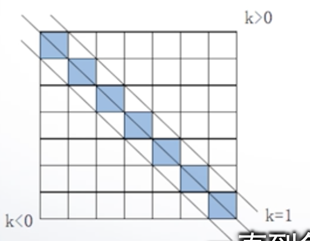
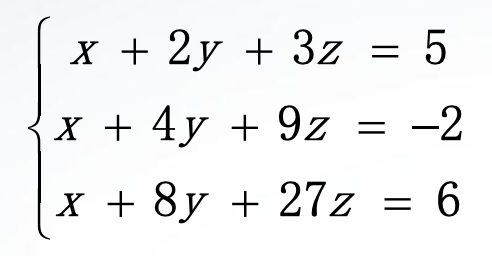
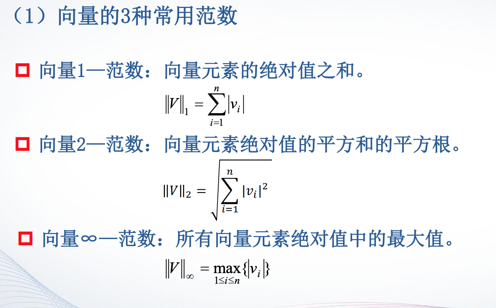
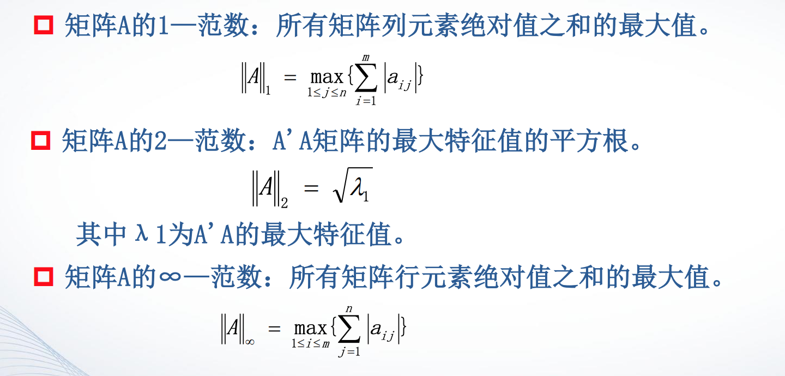

# 2.1 特殊矩阵
## zeros()
产生全零矩阵
```
zeros(3) % 产生m*m的零矩阵
zeros(m,n) % 产生m*n的零矩阵
zeros(size(A)) % 产生于矩阵A同样大小的矩阵
```

>例1 首先产生5阶两位随机整数矩阵A，再产生均值为0.6、方差为0.1的5阶
正态分布随机矩阵B，最后验证(A+B)I=IA+BI（I为单位矩阵）。
```
A=fix(10+(99-10+1)*rand(5));
B=0.6+sqrt(0.1)*randn(5);
C=eye(5);
(A+B)*C==C*A+B*C
```

zeros()
## ones()
产生全1函数

## eye() 
产生对角线为1的矩阵。矩阵是方阵时为单位矩阵

## rand()
产生（0,1）区间均匀分布的随机矩阵

## randn()
产生均值为0，方差为1的标准正态分布随机矩阵

## 学科特殊矩阵(详见ppt)
### magic矩阵
- n阶魔方阵由1,2,3,…,n2共n2个整数组成，且每行、每列以及主、副对角线上各n个元素之和都相等。
- n阶魔方阵每行每列元素的和为(1+2+3+…+ n2)/n=(n+n3)/2
- n>2时有很多不同的n阶魔方阵，MATLAB函数magic(n)产生一个特定的魔方阵。
> 产生8阶魔方阵，求其每行每列元素的和。
```
>> M=magic(8);
>> sum(M(1,:))
ans =
260
```

### 范德蒙矩阵vander(V)
```
 A=vander(1:5)
A =
1 1 1 1 1
16 8 4 2 1
81 27 9 3 1
256 64 16 4 1
625 125 25 5 1
```
- 范德蒙矩阵常用在各种通信系统的纠错编码中，例如，常用的Reed-Solomon编码即以范德蒙矩阵为基础。


### 希尔伯特矩阵hilb(n)
```
format rat
>> H=hilb(4)
H =
1 1/2 1/3 1/4
1/2 1/3 1/4 1/5
1/3 1/4 1/5 1/6
1/4 1/5 1/6 1/7
```
- 希尔伯特矩阵是著名的病态矩阵，即任何一个元素发生较小的变动，整个矩阵的值和逆矩阵都会发生很大变化。病态程度和矩阵的阶数相关，随着阶数的增加病态越严重。

### 伴随矩阵
```
 p=[1,-2,-5,6];
>> A=compan(p)
A =
2 5 -6
1 0 0
0 1 0
```

### 帕斯卡矩阵pascal(n)
- 帕斯卡矩阵的第一行元素和第一列元素都为1，其余位置的元素是该元素的左边
元素与上面元素相加，即P(i,j)=P(i,j-1)+P(i-1,j)，且P(i,1)=1,P(1,j)=1。
> 生成5阶帕斯卡矩阵，验证它的逆矩阵的所有元素也为整数。
```
 format rat
>> P=pascal(5)
P =
1 1 1 1 1
1 2 3 4 5
1 3 6 10 15
1 4 10 20 35
1 5 15 35 70
>> inv(P)
ans =
5 -10 10 -5 1
-10 30 -35 19 -4
10 -35 46 -27 6
-5 19 -27 17 -4
1 -4 6 -4 1 
```


# 2.2 矩阵变换
## 对角阵
- 对角阵：只有对角线上有非零元素的矩阵。
- 数量矩阵：对角线上的元素相等的对角矩阵。
- 单位矩阵：对角线上的元素都为1的对角矩阵。

1. 提取矩阵的对角线元素
   ```
   diag(A) % 提取矩阵A主对角线的元素
   diag(A,k)  % 提取矩阵A第k条对角线的元素
   ```
- 对角线的条数定义：
  

2. 建立对角矩阵
   ```
   diag(V) % V是一个向量
   diag(V,k) % 以向量V为第k条对角线元素，产生对角矩阵
   ```
   >先建立5×5矩阵A，然后将A的第一行元素乘以1，第二行乘以2，…，第五行乘以5。

```
>> A=[7,0,1,0,5;3,5,7,4,1;4,0,3,0,2;1,1,9,2,3;1,8,5,2,9]
A =
 7 0 1 0 5
 3 5 7 4 1
 4 0 3 0 2
 1 1 9 2 3
 1 8 5 2 9
>> D=diag(1:5); 
>> D*A % 注意乘的顺序
ans =
 7 0 1 0 5
 6 10 14 8 2
 12 0 9 0 6
 4 4 36 8 12
 5 40 25 10 45
 ```

 ### 三角阵
-  上三角阵：矩阵的对角线以下的元素全为零的矩阵。
- 下三角阵：对角线以上的元素全为零的矩阵。 

* `triu(A)`：提取矩阵A的主对角线及以上的元素。
* `triu(A,k)`：提取矩阵A的第k条对角线及以上的元素。 
### 矩阵的转置 
* 矩阵的转置：把源矩阵的第一行变成
目标矩阵的第一列，第二行变成第二
列，…，依此类推。
* 如果矩阵的元素是实数，那么转置和
共轭转置的结果是一样的。 
- 转置运算符是小数点后面接单引号（.'）。
- 共轭转置，其运算符是单引号（'），它在转置的基础上还要取每个数的复共轭。
```
>> A=[1,3;3+4i,1-2i]
A =
 1.0000 + 0.0000i 3.0000 + 0.0000i
 3.0000 + 4.0000i 1.0000 - 2.0000i
>> A.'
ans =
 1.0000 + 0.0000i 3.0000 + 4.0000i
 3.0000 + 0.0000i 1.0000 - 2.0000i
>> A'
ans =
 1.0000 + 0.0000i 3.0000 - 4.0000i
 3.0000 + 0.0000i 1.0000 + 2.0000i 
 ```

 ### 矩阵的旋转
 `rot90(A,k)`：将矩阵A逆时针方向旋转90º的k倍，当k为1时可省略。 

 ```
 >> A=[1,3,2;-3,2,1;4,1,2]
A =
 1 3 2
 -3 2 1
 4 1 2
>> rot90(A)
ans =
 2 1 2
 3 2 1
 1 -3 4
>> rot90(A,2)
ans =
 2 1 4
 1 2 -3
 2 3 1 
 ```

 ### 矩阵的翻转 
 ```
 fliplr(A)：对矩阵A实施左右翻转
 flipud(A)：对矩阵A实施上下翻转
 ```
 - 想要获取矩阵A的副对角线，应该采取上下翻转`flipud()`的方式

 >例2 验证魔方阵的主对角线、副对角线元素之和相等。
 ```
 ```
 ### 矩阵的求逆
- 对于一个方阵A，如果存在一个与其同阶的方阵B，使得AB=BA=I (I为单位矩阵)，则称B为A的逆矩阵，当然，A也是B的逆矩阵。
- inv(A)：求方阵A的逆矩阵。

>例 用求逆矩阵的方法解线性方程组。


```
 A=[1,2,3;1,4,9;1,8,27];
>> b=[5;-2;6];
>> x=inv(A)*b 

%也可以应用左乘 x=A\b  
```

# 2.3 矩阵求值
## 求行列式的值`det(A)`
> 例 验证det(A^-1)=1/det(A)。
```
A=fix(1+10*rand(8))
```
## 求矩阵的秩`rank(A)`
> 求3~20阶魔方阵的秩。
```
clc
clear

for n=3:20
    r(n)=rank(magic(n));
end
r
bar(r)
grid on
axis([2,21,0,20])
```
## 矩阵的迹trace(A)
- 矩阵的迹等于矩阵的对角线元素之和，也等于矩阵的特征值之和。
## 向量和矩阵的范数
矩阵或向量的范数用来度量矩阵或向量在某种意义下的
长度。


- norm(V)或norm(V,2)：计算向量V的2—范数。
- norm(V,1)：计算向量V的1—范数。
- norm(V,inf)：计算向量V的∞—范数。

## 矩阵的条件数
- 矩阵A的条件数等于A的范数与A的逆矩阵的范数的乘积。
- 条件数越接近于1，矩阵的性能越好，反之，矩阵的性能越差。

* cond(A,1)：计算A的1—范数下的条件数。
* cond(A)或cond(A,2)：计算A的2—范数数下的条件数。
* cond(A,inf)：计算A的∞—范数下的条件数。
> 求2~10阶希尔伯特矩阵的条件数。
```
for n=2:10
c(n)=cond(hilb(n));
end
format long
c'
```